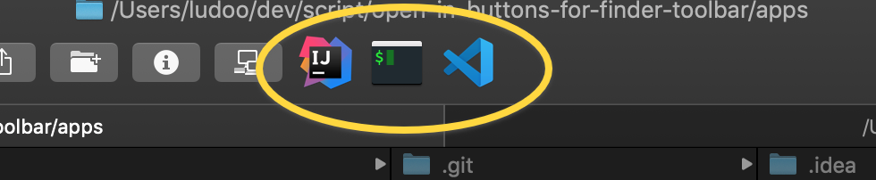

# 'open in' buttons for MacOS X Finder toolbar and mb pro touchbar

git : https://github.com/ludoo0d0a/open-in-buttons-for-finder-toolbar

## Finder toolbar

## Available apps
- Terminal
- iTerm
- TextMate
- Visual Studio Code
- Sublime text
- Atom
- IntelliJ

### Install
- Download apps
- copy to applications folder
- and drag it to Finder toolbar (hold `⌘cmd`)
- to remove old shortcut, drag them out of the toolbar.

## Macbook pro touchbar

  

## How to
### TouchBar. 
Open Setting -> Keyboard -> Touch Bar and add quick access buton to touch bar.  

  
Then open `*.workflow` files from `scr/touchbar` and save them.  
Or copy `*.workflow` files to `~/Library/Services`

## to create Finder toolbar
Open workflow in Automator, then convert/save it as Application
Inside sript can vary dependoing on app

To get a proper icon, open propeties panel of the new created app, and drag drop application with the chosen icon on the icon in the top left corner of the properties panel.

References:
 - https://github.com/cnstntn-kndrtv/open-in-buttons-for-finder-toolbar
 - https://medium.com/@n1kk/how-to-add-console-here-button-to-finder-toolbar-or-any-other-action-button-84dae9c34891
 - https://www.engadget.com/2008/01/01/mac-automation-saving-automator-workflows/
 - https://emmanuelbernard.com/blog/2017/02/27/start-intellij-idea-command-line/

## Sublime Text
Read [this topic](https://gist.github.com/artero/1236170 "this topic") before run "open-in-Sublime" app

## Text Mate
Read [this](https://manual.macromates.com/en/using_textmate_from_terminal.html "this") before run the app 

## How it works? How to change something?

take a look in `src` folder
